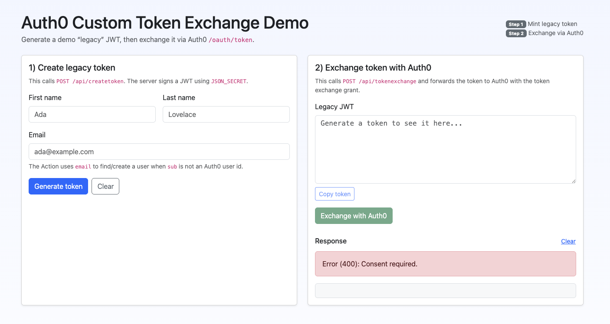

# Auth0 Custom Token Exchange (CTE) Demo (BETA)

This repo is an end-to-end demo of **Auth0 Token Exchange** using:

- **Terraform** to configure Auth0 (Token Exchange Profile + Action) and optionally deploy a demo app
- An **Auth0 Action** (trigger: `custom-token-exchange`) to validate a “legacy” token and map it to an Auth0 user
- A small **Node/Express demo app** (`src/project/`) that mints a demo “legacy” JWT and exchanges it via Auth0 `/oauth/token`

## What the demo does

1. The demo app mints a “legacy” JWT signed with `JSON_SECRET`
2. The demo app calls Auth0 `/oauth/token` using the **token exchange grant**:
   - `grant_type=urn:ietf:params:oauth:grant-type:token-exchange`
   - `subject_token_type=http://acme.com/legacy-token`
3. Auth0 runs the Token Exchange Action:
   - If the JWT `sub` is an Auth0 user id (starts with `auth0|`), it treats the user as **already in Auth0**
   - Otherwise it looks up by email and (for demo purposes) can create a user in the DB connection
4. Auth0 returns tokens to the demo app, which are displayed in the UI

## Screenshot



## Disclaimer

This project is a **reference demo** for learning and experimenting with Auth0 Custom Token Exchange. It is **not a drop-in “install and run” solution** and is **not production-ready**.

You should expect to:

- Provide your own Auth0 tenant + M2M credentials (for Terraform)
- Review and tailor the Token Exchange Action logic (identity mapping, user creation/update, validation rules)
- Adjust audiences/scopes and other security settings to match your environment

## Prerequisites

- Terraform `v1.8.1+`
- Auth0 tenant
- Auth0 Machine-to-Machine application credentials that allow Terraform to manage your tenant (domain, client ID, client secret)

### Optional (only if you want Terraform to deploy the demo app to Heroku)

- Heroku account + API key

## Quickstart (Terraform provisions Auth0 + deploys demo app to Heroku)

1. Clone the repo

```bash
git clone https://github.com/intheorysecurity/terraform-auth0-token-exchange.git
cd terraform-auth0-token-exchange
```

2. Create `terraform.tfvars`

```bash
cp terraform.tfvars.example terraform.tfvars
```

3. Edit `terraform.tfvars` and set values

- `auth0_domain`, `auth0_client_id`, `auth0_client_secret`
- `json_secret` (used to sign/verify the demo “legacy” JWT)
- If using Heroku deploy: `heroku_email`, `heroku_api_key`, `heroku_app_name`

4. Apply Terraform

```bash
terraform init
terraform plan
terraform apply
```

5. Open the URL printed by the `heroku_app_url` output

## Run the demo app locally (no Heroku)

If you don’t want to host the app on Heroku, you can run the Node app directly:

- See [`src/project/README.md`](src/project/README.md) for local run instructions.
- You still need an Auth0 tenant configured with the Token Exchange Profile + Action (Terraform can do that for you).

## What Terraform configures

- **Auth0**
  - A non-interactive (M2M) “Token Exchange Demo App” client
  - A Token Exchange Action (`custom-token-exchange` trigger)
  - A Token Exchange Profile (type `custom_authentication`) with `subject_token_type=http://acme.com/legacy-token`
  - A Resource Server (API) with identifier `http://acme.com/legacy-token` (used as the token exchange `audience`)
  - A Client Grant linking the M2M client to the Resource Server
  - Action secrets for verifying the legacy JWT (`json_secret`) and (optionally) calling the Management API to find users by email
- **Heroku (optional)**
  - Deploys the demo Node app under `src/project/` and sets needed environment variables

For the exact Terraform resources and settings, see [`main.tf`](main.tf).

## Limitations / notes

- The demo can create users in the default DB connection (`Username-Password-Authentication`) when a user can’t be found. Adjust this for real-world flows.
- MFA scenarios aren’t handled in the demo UI.
- For this demo, **“Allow Skipping User Consent” must be enabled** for the target API/audience, otherwise the token exchange request will fail with a consent-related error (the demo does not handle consent prompts).

## Contributing

Pull requests are welcome. For major changes, please open an issue first to discuss what you would like to change.

## License

[MIT](https://choosealicense.com/licenses/mit/)
